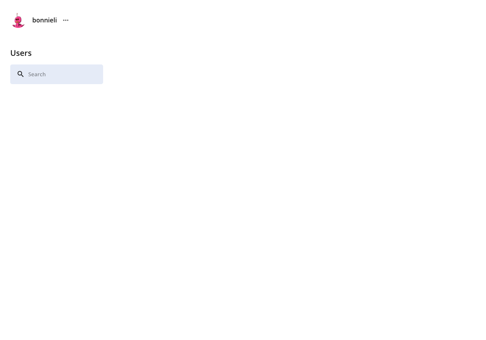

## Messenger

A Messenger web app that allows users who speak completely different languages to communicate with each other in their native tongue with on-the-spot translation!

## Contributors

[Ted Gu](https://github.com/TedGu), [Stefan Leoussis](https://github.com/stefanleoussis), and [Lei Weing](https://github.com/leiwang758) 

## Tech Stack
Our Stack:
- MongoDB
- Express.js
- React.js
- Node.js
- Typescript

---

### Getting Started

1. Clone or download repository

---

## Server

1. Go into the server director `cd server`
2. Run `npm install` to install packages
3. Create your environment variable (.env) file
4. Run `npm run dev` to start the server

---

## Client

1. Go into the client directory `cd client`
2. Run `npm install` to install packages
3. Run `npm start` to start the client side

---

## Demo

### Choose Your Path: 

Quickly Register with the built in Demo feature (Top right corner):

    

Or create a new account using an email and password:

<!-- 2. Dashboard. Here is a description about what a user can expect to see

 -->
